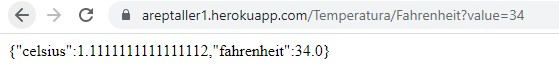

## ArepTarea1

### Autor: Juan Sebastian Ospina  -Fecha:  02/09/2022


# **CambiandoAndo**

CambiandoAndo es un api de conversion de unidades, en su version 1.0 encontramos la conversion de temperatura, se esta trabajando mas para permitir extender el poder de esta api

### **Como consumir el api**

Para hacer consumo de nuestra poderosa api podemos hacer uso de la pagina web donde se explica mas a fondo su uso y formas de implementar en diferentes espacios
```
APP de heroku : https://areptaller1.herokuapp.com
```

### **Arquitectura**

Esta api esta en un arquitectura REST donde el servidor va a recibir un verbo sea GET en este caso, donde se va porcesar la solicitud y esta se va a devolver en un formato JSON para un entendimiento sencillo, ademas de esto vamos a apreciar que el diseño de la api permite una gran expansion ya que esta divida por interfaces las cuales van a dar una extensibilidad muy alta en nuestro proyecto, llegano a implementar ya no solo un /Temperatura si no que vamos a dividir en posibles /Exchage o /Distance para poder dar una experiencia mucho mas completa con nuestra poderosa api.

### **Funcionamiento**

El metodo de funcionamiento de nuestra api es haciendo uso de  [Spark](https://sparkjava.com/) el cual es un micro Framework que nos permite mediante el uso de metodos estaticos poder relizar consultas y hacer redireccionamientos.


Posterior a eso el api como se menciona hace uso de interfaces para poder contar con una gran extenibilidad, asegurando que al querer implementar una nueva unidad en un grupo se deban cumplir la conversion con todas la que ya estaban


Esto tambien se va a ver el las URL para poder separar los grupos de unidades de media.




### Testing

Nuestra api cuenta con pruebas ya creadas tanto locales a los servicios creados, como al despliege de la api con pruebas concurrentes desde java

Para correr las pruebas concurrentes toca correr el main de la clase ConcurrentTest estas imprimen en consola el resultado que se obtubo  con un "GET DONE" si esta correcta y un "GET request not worked" en caso de no poder conectase 

